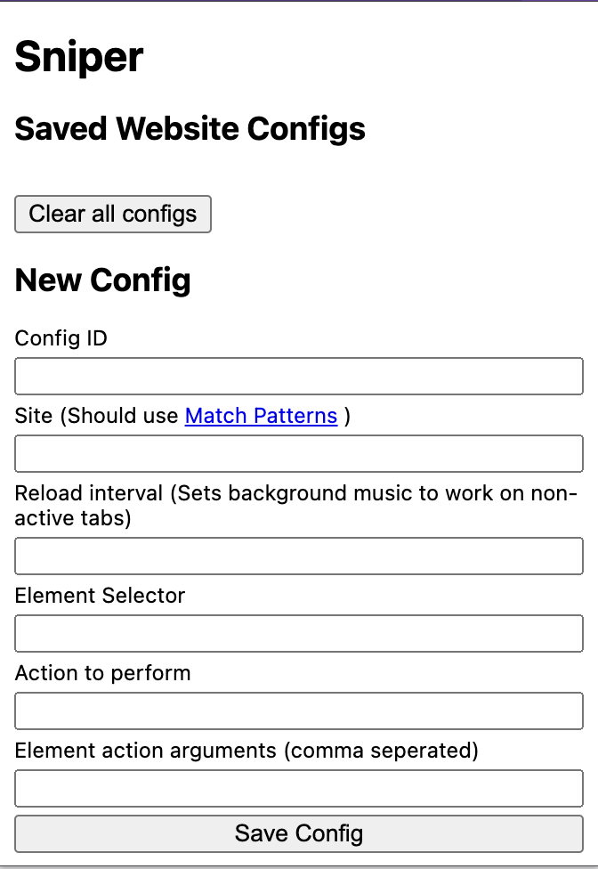
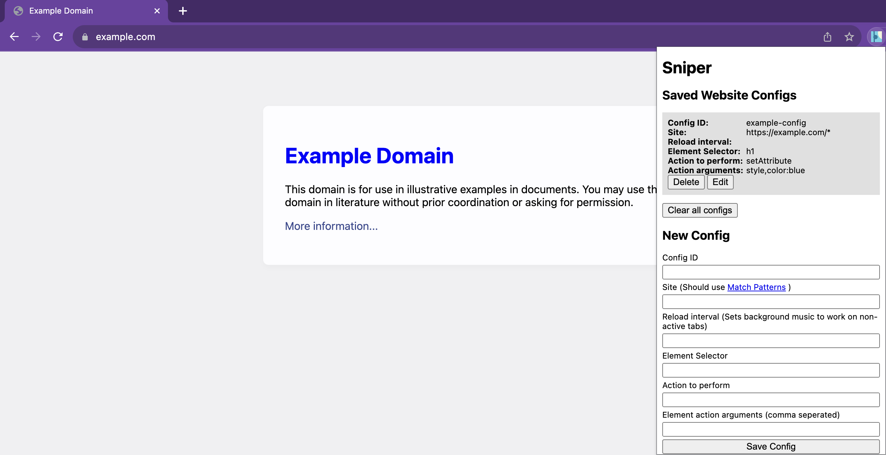
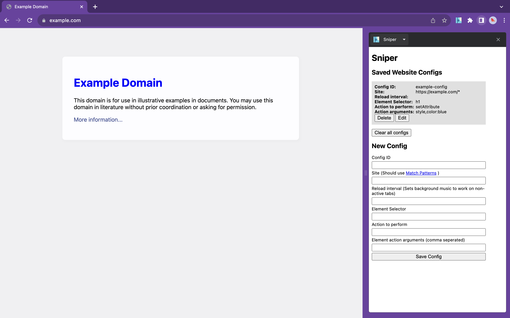
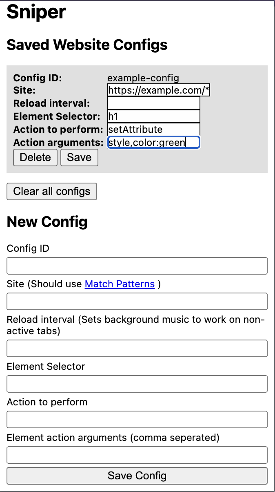

# Sniper

A Manifest V3 extension to perform dynamic user specified actions on a web page without `userScripts` permission (And thus w/o need for developer mode).

## How

By using [Computed property names](https://developer.mozilla.org/en-US/docs/Web/JavaScript/Reference/Operators/Object_initializer#computed_property_names).  
The provided selector string is directly passed onto `document.querySelector` and the provided `action` and `arguments` are then applied to each element as `elem[action](...args)` or as values to HTML Element properties as `elem[action] = args`

## Screenshots

### Popup

### Usage

### Integrates with Sidepanel

### Edit Saved Config

## Acknowledgments

The avatar style Shapes is based on: Shapes by Florian Körner, licensed under CC0 1.0 . From <a href="https://www.dicebear.com/styles/shapes/">Dicebear</a>

Sound Effect from <a href="https://pixabay.com/?utm_source=link-attribution&utm_medium=referral&utm_campaign=music&utm_content=64368">Pixabay</a>